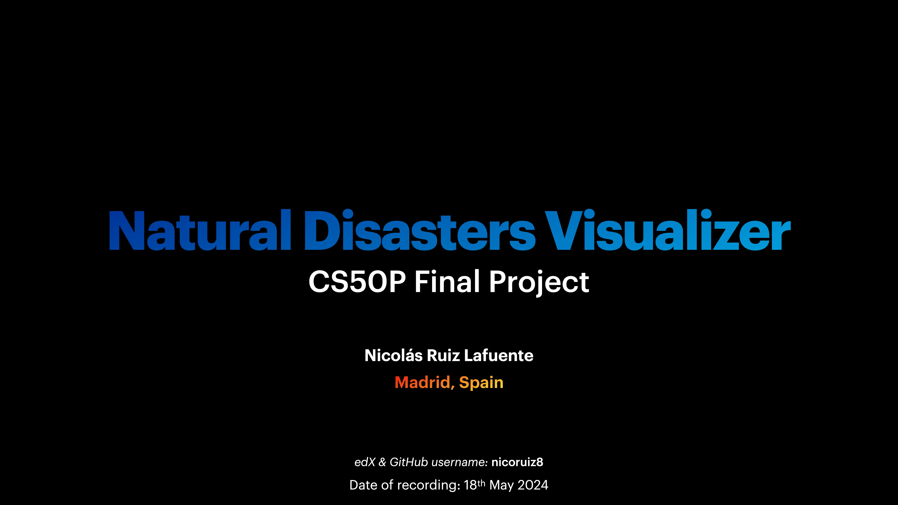
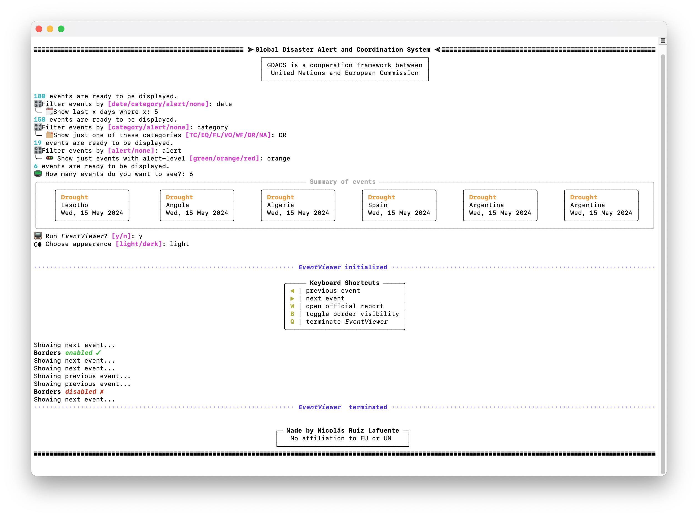
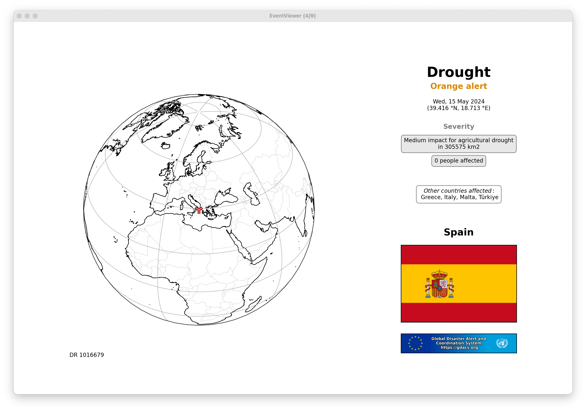
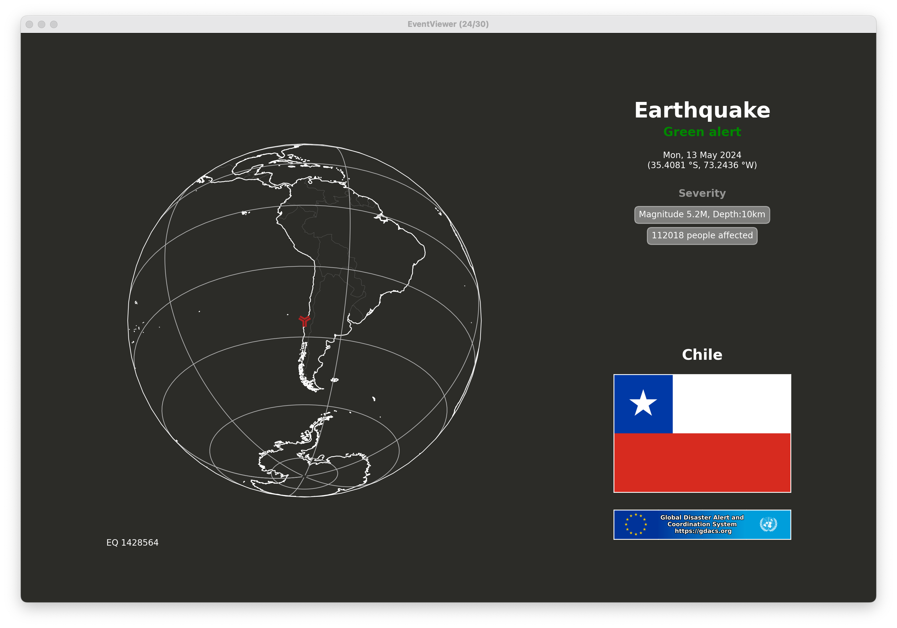

# Natural Disasters Visualizer (CS50P Final Project)

**Author:** Nicolás Ruiz Lafuente\
**City:** Las Rozas de Madrid, SPAIN 🇪🇸


### Video Demo:
[](https://youtu.be/UJNKGxsRYe0)

> [!WARNING]
> A key part of this project relies on interactive *matplotlib* figures. Headless environments may not allow for figures to be displayed. Please, refer to the video demo to see the project working as intended in my own local machine.


## Introduction
Welcome to my CS50P Final Project! This project provides a way to visualize the latest natural disasters worldwide using data from the [*Global Disaster Alert and Coordination System* (GDACS)](https://gdacs.org) API, a cooperation framework between the ***United Nations*** 🇺🇳 and the ***European Commission*** 🇪🇺. The project aims to offer an easy and efficient method to retrieve and display information on recent natural events, helping users stay informed about global disasters.


## Requirements
 - Python 3.12.3
 - (Recommended) Create virtual environment within *project* folder
 ```bash
 >> cd path/to/project/folder    # Navigate to project folder
 >> python3.12 -m venv ./venv    # Create virtual environment within folder
 >> source venv/bin/activate     # (macOS/Linux) Activate venv
 >> venv\Scripts\activate        # (Windows) Activate venv
 ```
  - Other dependencies listed in *requirements.txt*
 ```bash
 >> pip install -r requirements.txt
 ```


## Usage


In order to use this code, follow the next instructions:

**1. Initialize the code**
```bash
>> cd path/to/project/folder    # Navigate to project folder
>> python project.py            # Run the program
```
The program will immediatelly request the API for the latest events and collect them in a container. You will then see the total number of retrieved events and be asked whether you want to filter them.
```
XXX events are ready to be displayed.
🎛️ Filter events by [date/category/alert/none]:
```

**2. Apply filters**

You can filter events by *date*, *category* or *alert*-level. The three filters can be applied in the same session. If the combination of filters results in 0 compatible events, the session will terminate.
```
╰─ 🗓️ Show last x days where x:
╰─ 🗂️ Show just one of these categories [TC/EQ/FL/VO/WF/DR/NA]:
╰─ 🚥 Show just events with alert-level [green/orange/red]:
```

**3. Number of events and summary**

After applying (or not) the filters, choose the number of events you want to display. If you choose 0, the program will terminate the session. A panel summary will be printed with individual blocks for the chosen events.
```
📟 How many events do you want to see?:
```

**4. *EventViewer***

Finally, you will be asked whether you want to launch the `EventViewer` for the chosen events. If you decide to run the viewer, choose the appearance (light or dark mode). Important keyboard shortcuts for interacting with the viewer will be printed.

> [!NOTE]
> The map displays a midpoint of the affected area, while the flag is just the first country (alphabetically, local) of all the affected. This can be seen in the example below: the map is centered around Italy and Greece and still the Spanish flag (España) is the one shown.






## Project Structure
The code for this project is divided into three primary modules, apart from the main script `project.py`. These modules are `eventsGDACS`, `geocode`, and `utilities`. Each module plays a crucial role in handling different aspects of the project, from data retrieval and processing to visualization and utility functions.

### eventsGDACS Module
The `eventsGDACS` module contains three classes that manage GDACS Natural Disasters Events:

1. **`Event` Class:**
    - Represents a natural disaster event with characteristics defined by the GDACS API.
    - Attributes include:
        - **event ID (*evid*):** Unique numerical identifier set by GDACS.
        - **title (*title*):** Keywords describing the event.
        - **description (*description*):** Brief description of the event.
        - **category (*category*):** Event types such as "Tropical Cyclone", "Earthquake", "Flood", etc.
        - **alert level (*alert*):** Severity level (green, orange, or red).
        - **severity (*severity*):** Description of the impact on the local community.
        - **population affected (*population*):** Number of affected people.
        - **date (*date*):** Date of the latest update from GDACS.
        - **coordinates (*coordinates*):** Latitude and longitude of the affected area.
        - **countries affected (*country*):** List of affected countries (alphabetical order).
        - **country code (*iso2*):** [ISO3166](https://www.iso.org/iso-3166-country-codes.html) Alpha-2 code for the first country in the list.
        - **URL (*link*):** Link to the official GDACS report.
    - Method `get_categories()`: Returns the list of allowed categories and their corresponding two-letter keys.

2. **`EventContainer` Class:**
   - A list-like object that holds multiple `Event` instances.
    - Method `request()`: Retrieves information from [API](https://www.gdacs.org/xml/rss_7d.xml), parses it into different `Event` objects and stores them in the container.
   - Method `panel()`: Rich-prints a summary of events with color-coded categories, countries, and dates organized in distinct blocks.

3. **`EventViewer` Class:**
   - Visualizes `Event` data using *matplotlib*.
   - Features an orthographic projection of Earth centered on the event's coordinates.
   - Displays a block of text describing event characteristics and the affected country's flag.
   - Interactive behaviour through keyboard shortcuts.

### geocode Module
The `geocode` module includes static methods under the `Geocode` class, all related to geocoding and coordinates handling. The main method `get_flag()` performs a request to the [Flagpedia API](https://flagpedia.net) to retrieve a country's latest official flag. This module is crucial for accurately displaying geographical information (coordinates, ISO country codes, names, etc.) and enhancing visual representations with national flags.

### utilities Module
The `utilities` module contains various methods that support different parts of the project. These utility functions are essential for tasks such as data manipulation, formatting, and error handling. Although not all methods are explicitly used in the final project, they were instrumental during the development process for testing and refining different versions of the code.

### `project.py` (main program)
This is the main program of the project. Here, all of the previous modules are applied to achieve the visualization of the natural disasters. Most of the printing is done using the *rich* package. Apart from the two functions dedicated just to create initialization and termination UIs:
   - `wrap_text()`: as its name says, it is used to wrap a long text given a max width (number of characters per line)
   - `date_filter()`: used to filter events if they happend in the last X days from today
   - `category_filter()`: keep only events of one category
   - `alert_filter()`: keep only green, orange OR red events
   - `filter_events()`: this function applies one of the previous filter to an `EventContainer`and returns a new container with the filtered events. *functools.partial* is used to associate the filtering key to the chsoen filter before applying it to the input container


## Design Choices
Several design decisions were made during the development of this project to ensure clarity, efficiency, and user-friendliness:

1. **Modular Design:**
   - The project is divided into distinct modules (`eventsGDACS`, `geocode`, `utilities`) to promote separation of concerns and maintainability. This structure makes the codebase easier to navigate and extend. For example, the `geocode` module would be perfectly useful in other projects that have nothing to do with this one.

2. **Class-Based Approach:**
   - Utilizing classes (`Event`, `EventContainer`, `EventViewer`) allows for encapsulating related data and functionality, leading to even more organized and reusable code.

3. **Data Relevance:**
   - Although the GDACS API provides over 30 characteristics for each event, only the most relevant ones were included to keep the information concise and focused on the user's needs.

4. **Visualization:**
   - Using *matplotlib* for visualization offers a powerful, interactive, and flexible way to create informative representations. Other options like *tkinter* were considered but not chosen.

5. **Other API Integration:**
   - Integrating the Flagpedia API for retrieving country flags enhances the visual context of the events, making the visualization more engaging and informative.
   - Furthermore, there is an unused method `Geocode.get_code()` intended to reverse geocode coordinates to guess which country you are in, making use of Nominatim-OpenStreetMap API. However, this wasn't used in the final project due to the strict limits Geocoding APIs tend to set, which ends up slowing down the code too much.

6. **Data source:**
   - In the first stages of development, a different API was used as source for natural disasters. This was NASA's [Earth Observatory Natural Event Tracker (EONET)](https://eonet.gsfc.nasa.gov). However, the events were conistently out of date and missing key information.
   - In the end, GDACS was chosen as source of information given its near-real-time nature and extended descriptions.


## Conclusion
This project demonstrates a comprehensive approach to visualizing natural disasters using public APIs. The modular design, thoughtful selection of relevant data, and integration of visualization tools all contribute to a robust and user-friendly application. I hope this project serves as a valuable tool for anyone interested in staying informed about global natural disasters.


## Disclaimer
It is important to note that I have **NO affiliation to the *United Nations* nor the *European Commission*** and this is simply a CS50P Final Project. Furthermore, I have no intention of replacing the official GDACS website or its own event visualizer.
